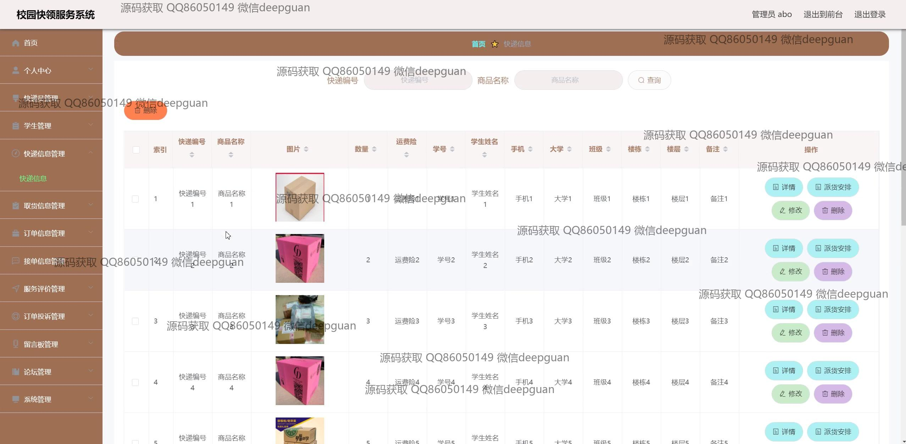
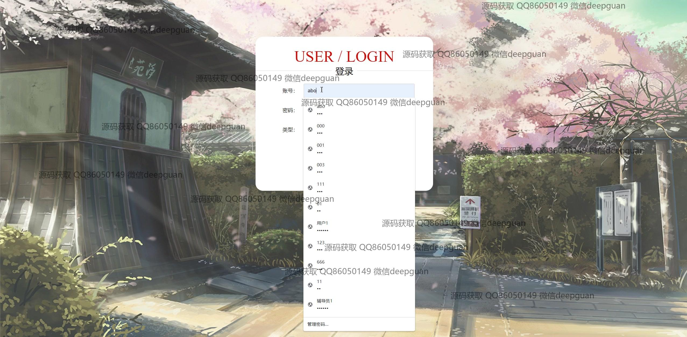
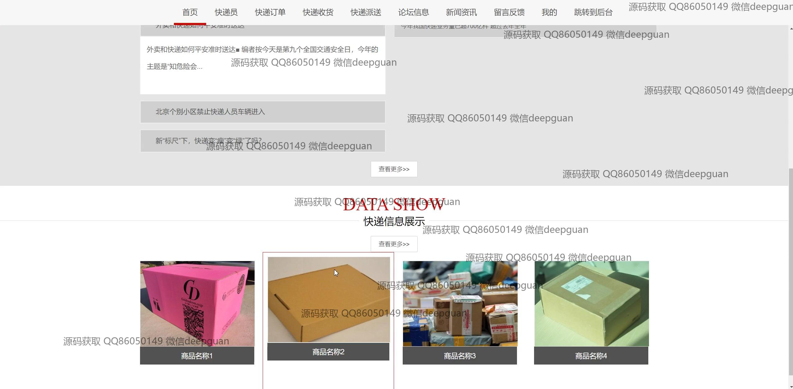

<h1 align="center">的校园快递快领服务系统vue</h1>

## 简介
校园快递快领服务系统：角色分为快递员、学生、管理员；具备用户注册、订单管理、快递信息查询、留言反馈及信息发布等功能，旨在提升校园快递管理效率和用户体验。    --计算机毕业设计源码；毕设源码；java毕业设计源码

## 联系方式

<h3 align="center">获取完整代码与数据库文件 + 微信：deepguan QQ: 86050149 QQ群: 783742310</h3>

<h3 align="center">可帮忙远程部署 包运行成功！提供远程部署、修改代码、设计文档指导、代码讲解等服务！</h3>

## 功能介绍（完整见运行截图）
管理员：基本功能包括登录、登出、注册，以及用户管理、快递员管理、快递信息管理、订单管理和投诉管理。管理员可以访问和编辑订单信息，管理快递员和用户的详细信息，进行留言板管理和服务评价的审核，以及发布和编辑信息。后台提供各模块导航和便捷的操作选项，以便于高效管理和运行系统功能。

快递员：快递员角色的界面允许查看和编辑个人信息， 包括姓名、联系方式、性别、年龄及所属快递公司。快递员可以录入和管理快递包裹信息，查看具体的订单信息，并管理取货、派送状态。快递员还可以查看用户的留言反馈及相关商品的评论，提供真实有效的反馈以优化服务质量。

学生用户：用户可以通过注册和登录访问系统，查看和管理个人快递信息。个人中心允许用户查看自己的学号、姓名、联系方式等信息。用户可以进行订单信息管理，浏览快递信息，提交或投诉订单，查看派送与取货状态。用户可以对服务提供反馈，并与系统内提供的留言板进行互动。

公共功能：导航栏在系统中始终可见，提供快速入口到各个功能模块，如快递员管理、订单管理、留言反馈、收藏管理等。支持搜索功能以便于查找快递及订单详细信息。提供服务评价和投诉管理模块以增进用户体验。系统设计简洁，易于各角色快速适应和操作。

## 运行截图

本代码来源于网络,仅供学习参考使用!

